# [Vita-la-revolution](https://drive.google.com/file/d/1LSAfVDiMjuTC3RUIxTzwb5kZKV1oGqKA/view?usp=sharing) ⚔️

> Click on the image below to watch the video 🎥👇🏾
>
> 

## 📌 Introduction

Welcome to **Vita-la-revolution**, a capstone project dedicated to developing a revolutionary **Health Tracking and Graphing App**. Designed with a focus on children and the elderly, this app simplifies health management by providing an intuitive platform for monitoring various health-related parameters.

## 🩺 Core Functionality

### Categories Tracked:
- **Medication:** Record when medications are taken.
- **Vitals:** Monitor key vitals such as blood pressure and heart rate.
- **Nutrition:** Keep track of the intake and output of food and liquids.
- **Others:** Keep track of sub-categories users make.

### Data Representation:
- All data entries are stored and visually presented in easy-to-understand graphs, facilitating quick reviews and sharing with healthcare professionals, thus enhancing diagnostic efficiency and reducing wait times.

## 🗝️ Key Features

### Sub-categories within Main Categories:
- Each main category like **Vitals** and **Medication** includes sub-categories (e.g., Tylenol for Medication, Blood Pressure for Vitals).
- Users can add custom sub-categories as needed.

### User Interaction Screens:
- **`Home Screen:`**
  - Features a calendar to review data entries by date.
  - Offers a data card to swipe through and see brief summaries of different entries.
  - Includes reminders to alert users about medications and appointments.
- **`Viewing Screen:`**
  - Allows users to filter data.
  - Graphically displays information, sorted by categories and sub-categories.
- **`Add Data Screen:`**
  - Enables data entry into existing or new sub-categories.
- **`Profile Screen:`**
  - Manages user profiles and settings.
  - Allows adding of sub-users, suitable for families or caregivers managing multiple profiles.
- **`Settings Screen:`**
  - Provides options to manage app permissions and clear stored data.

## 📜 [Explore Vita's Code on GitHub](https://github.com/Valentine-Jingwa/Vita)

## Objectives

The ultimate goal of our app is to facilitate ongoing health management, making it more accessible and straightforward, particularly for the elderly and monitoring of children. This functionality supports better communication with healthcare providers and fosters a proactive approach to health maintenance.

Revolutionizing How You Manage You and Your Loved One's Health! 🚀

## 🌟 Contributors

Special shoutouts to the incredible team members who made this project possible:

[Project Vita](https://github.com/Valentine-Jingwa/Vita)
---
- [**Valentine Jingwa**](https://www.linkedin.com/in/valentine-achalefi-jingwa-12607b252/) 
- [**Jonah Scott**](https://github.com/jonahscott) 
- [**Nicholas Gonzalez**](https://github.com/nicoatsait) 
- [**Jaclyn Burry**](https://www.linkedin.com/in/jai-burry-a3039222b/) 
- [**Jean-Pierre Nde-Forgwang**](https://www.linkedin.com/in/jean-pierre-n/) 

## App Screenshots

  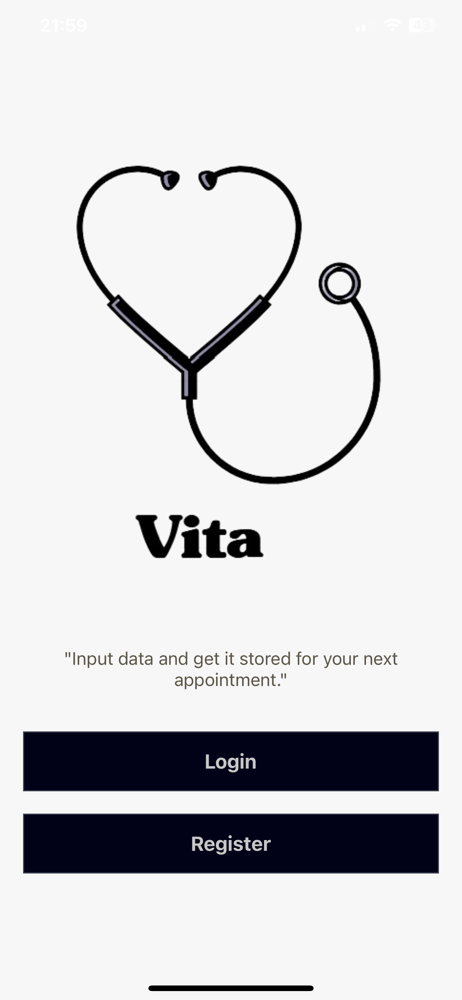
  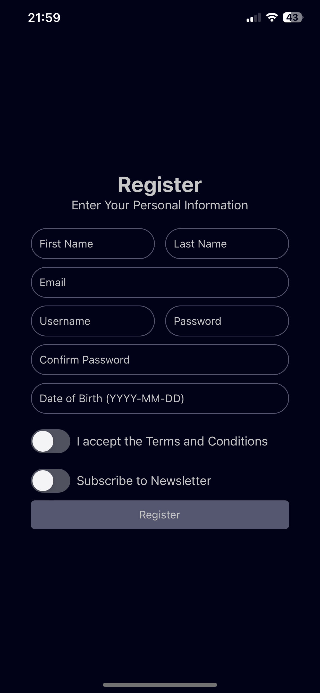
  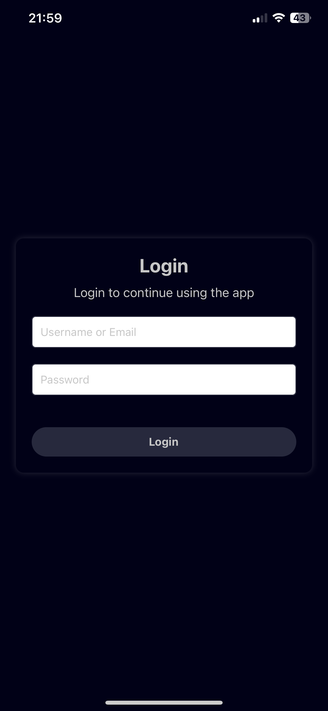

  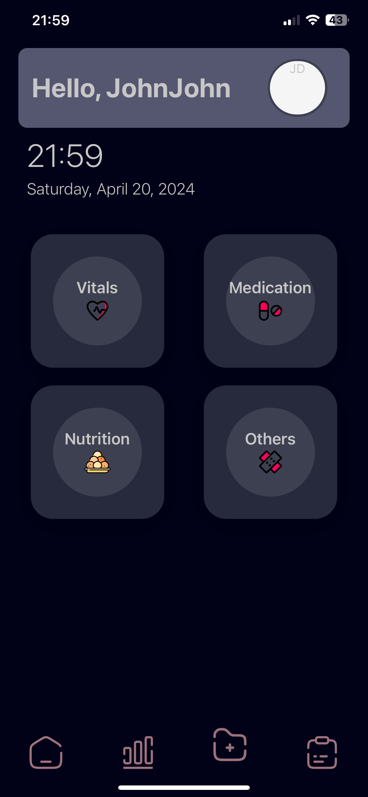
  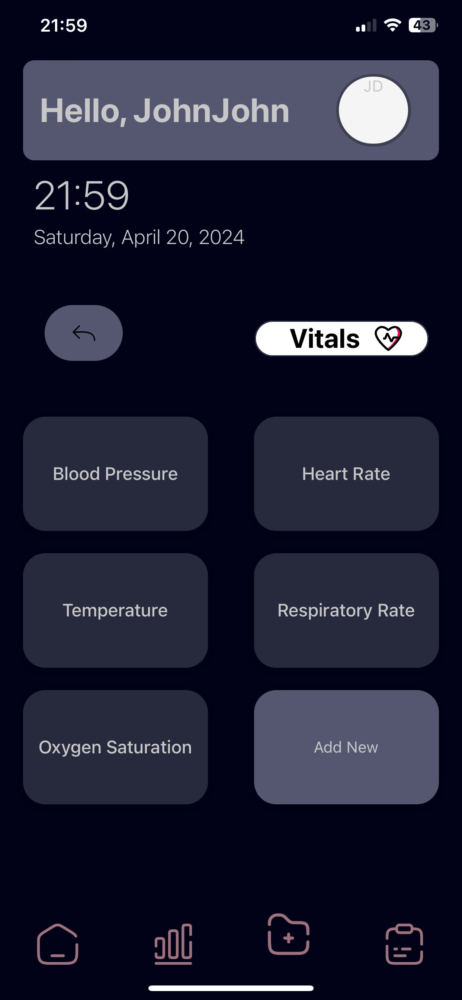
  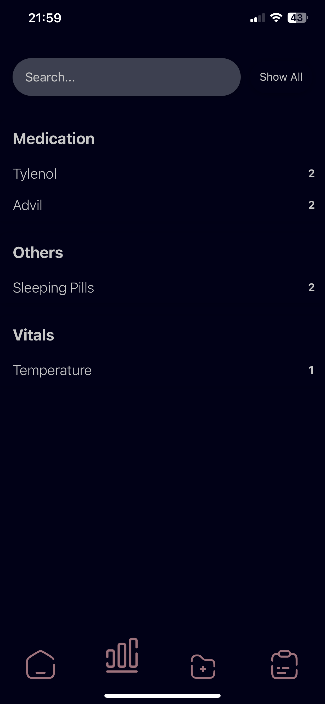

  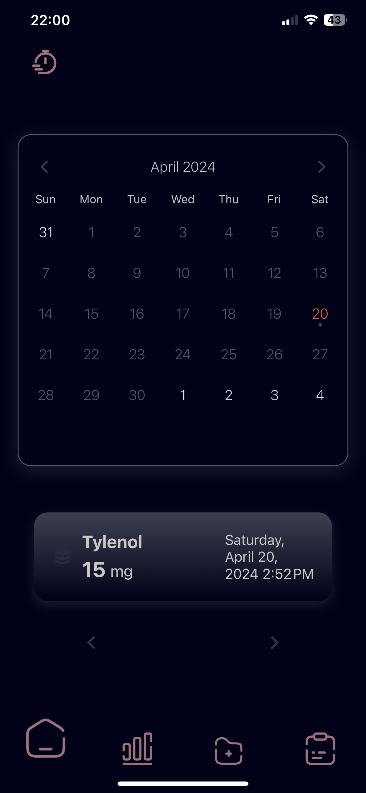
  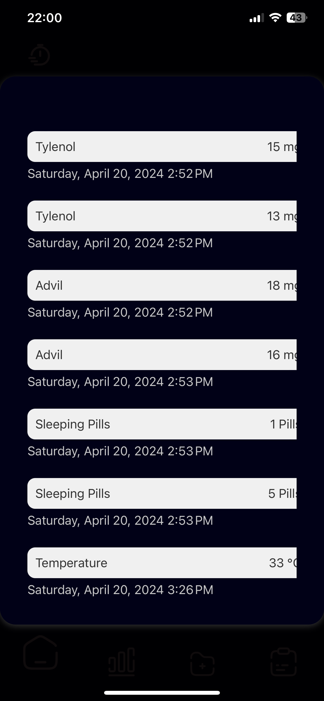
  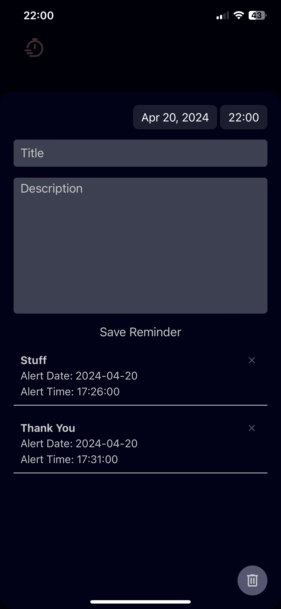

  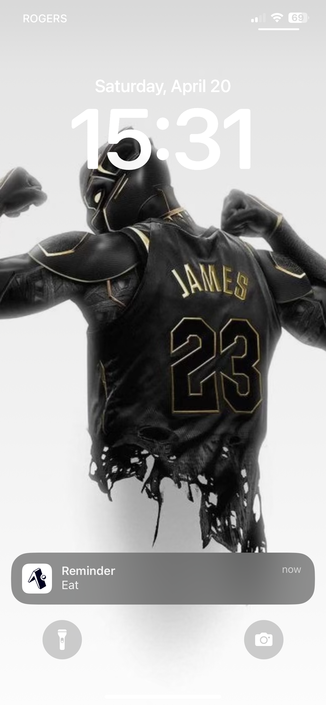
  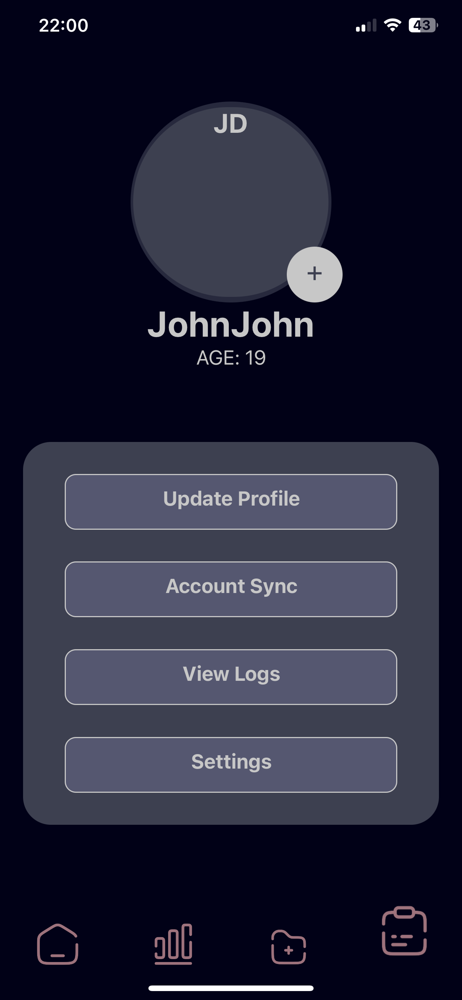
  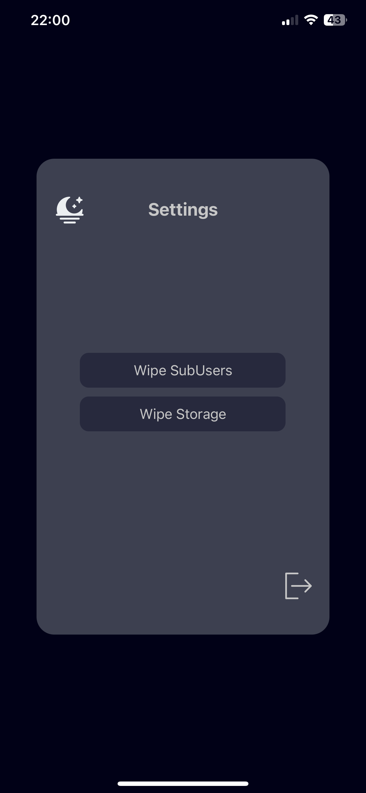

  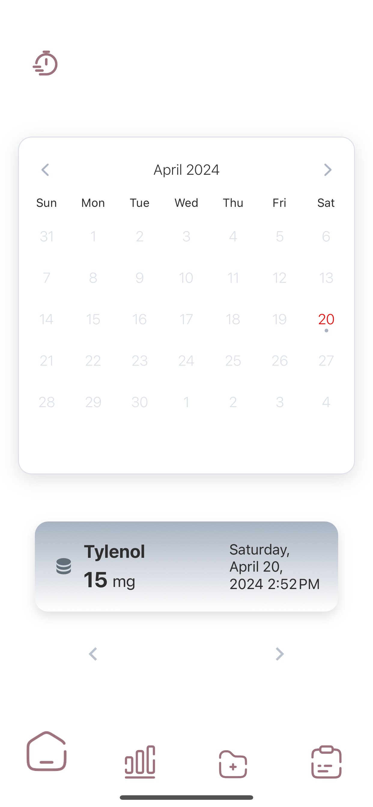
  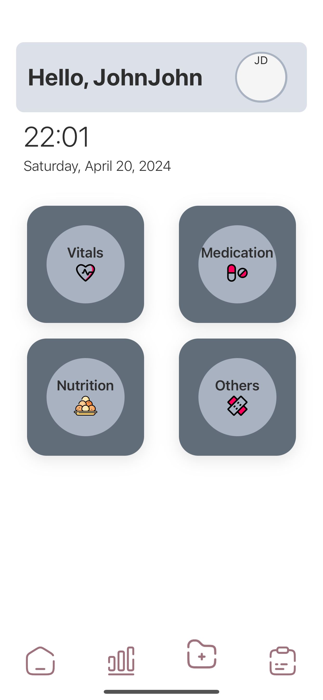
  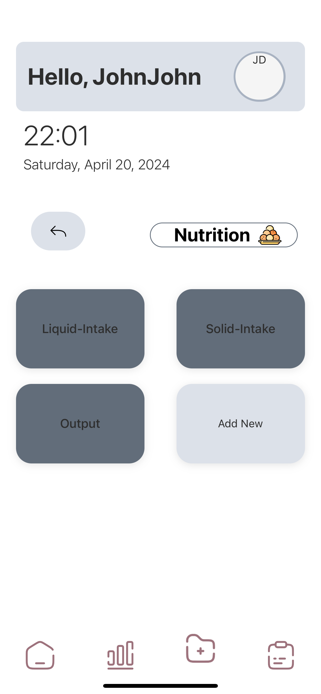

  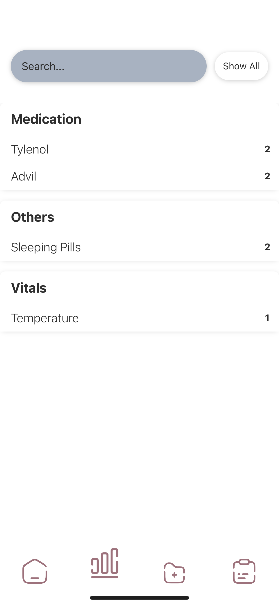
  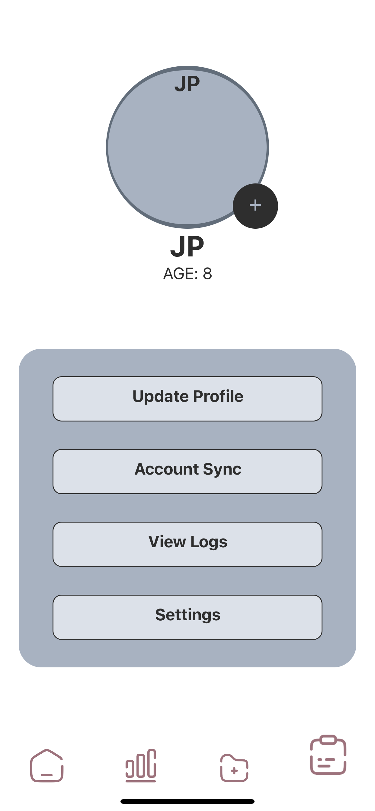
  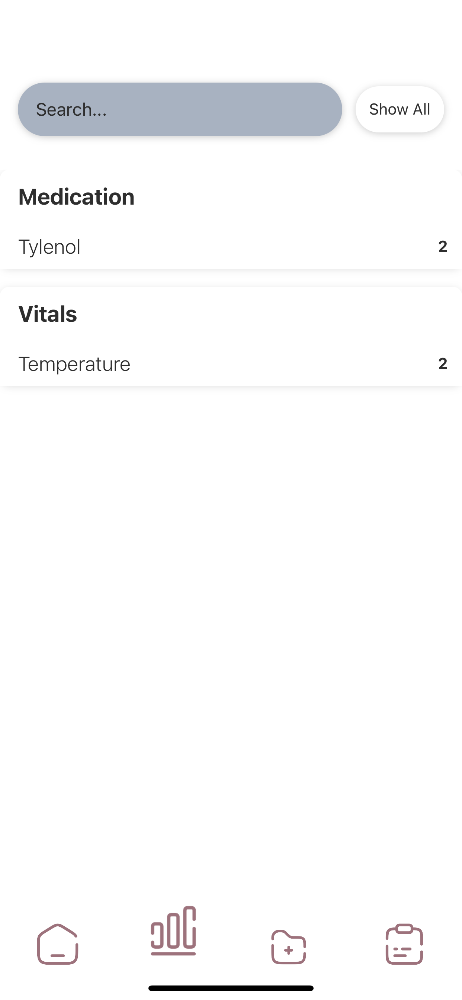

  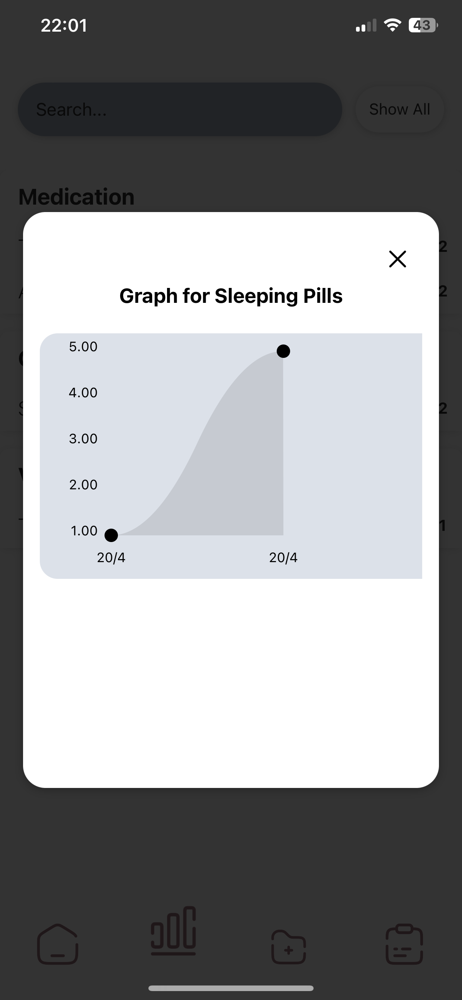
  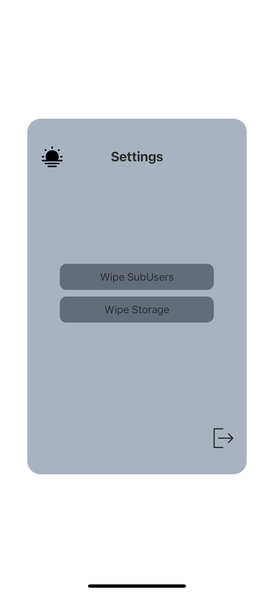
  

  

  <!-- Continue adding rows as needed -->

